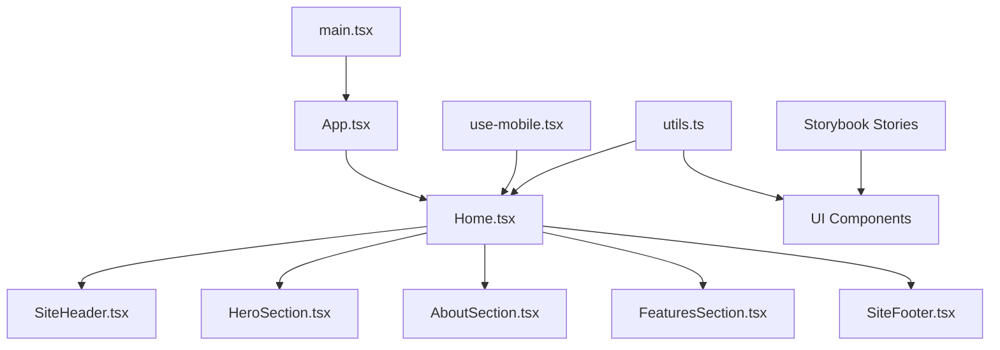
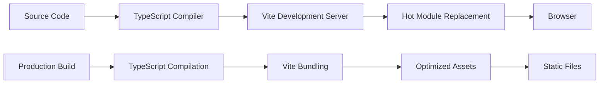

# Project Architecture

This document outlines the architecture, structure, and data flow of the landing page application.

## Project Structure

```
landing/
├── 📄 Configuration Files
│   ├── package.json              # Project dependencies and scripts
│   ├── tsconfig.json            # TypeScript configuration
│   ├── tsconfig.node.json       # Node.js TypeScript config
│   ├── vite.config.ts            # Vite build configuration
│   ├── tailwind.config.js         # Tailwind CSS configuration
│   ├── postcss.config.js          # PostCSS configuration
│   ├── eslint.config.js          # ESLint linting rules
│   ├── jsdoc.json               # JSDoc documentation config
│   └── .jsdocrc.json           # JSDoc plugin settings
│
├──  Documentation
│   ├── README.md                # Main project documentation
│   ├── docs/                   # Generated documentation
│   │   ├── README.md            # Documentation generation guide
│   │   ├── generate_docs.md     # How to generate docs
│   │   └── architecture.md      # This file
│   └── .jsdocignore           # JSDoc exclusion patterns
│
├──  Source Code
│   ├── src/                    # Main source directory
│   │   ├── components/          # React components
│   │   │   ├── ui/            # Reusable UI components
│   │   │   │   ├── accordion.tsx
│   │   │   │   ├── alert-dialog.tsx
│   │   │   │   ├── alert.tsx
│   │   │   │   ├── aspect-ratio.tsx
│   │   │   │   ├── avatar.tsx
│   │   │   │   ├── badge.tsx
│   │   │   │   ├── breadcrumb.tsx
│   │   │   │   ├── button.tsx
│   │   │   │   ├── calendar.tsx
│   │   │   │   ├── card.tsx
│   │   │   │   ├── carousel.tsx
│   │   │   │   ├── checkbox.tsx
│   │   │   │   ├── collapsible.tsx
│   │   │   │   ├── command.tsx
│   │   │   │   ├── context-menu.tsx
│   │   │   │   ├── dialog.tsx
│   │   │   │   ├── drawer.tsx
│   │   │   │   ├── dropdown-menu.tsx
│   │   │   │   ├── empty.tsx
│   │   │   │   ├── field.tsx
│   │   │   │   ├── form.tsx
│   │   │   │   ├── hover-card.tsx
│   │   │   │   ├── input-group.tsx
│   │   │   │   ├── input-otp.tsx
│   │   │   │   ├── input.tsx
│   │   │   │   ├── item.tsx
│   │   │   │   ├── kbd.tsx
│   │   │   │   ├── label.tsx
│   │   │   │   ├── menubar.tsx
│   │   │   │   ├── navigation-menu.tsx
│   │   │   │   ├── pagination.tsx
│   │   │   │   ├── popover.tsx
│   │   │   │   ├── progress.tsx
│   │   │   │   ├── radio-group.tsx
│   │   │   │   ├── resizable.tsx
│   │   │   │   ├── scroll-area.tsx
│   │   │   │   ├── select.tsx
│   │   │   │   ├── separator.tsx
│   │   │   │   ├── sheet.tsx
│   │   │   │   ├── sidebar.tsx
│   │   │   │   ├── skeleton.tsx
│   │   │   │   ├── slider.tsx
│   │   │   │   ├── sonner.tsx
│   │   │   │   ├── spinner.tsx
│   │   │   │   ├── switch.tsx
│   │   │   │   ├── table.tsx
│   │   │   │   ├── tabs.tsx
│   │   │   │   ├── textarea.tsx
│   │   │   │   ├── toggle-group.tsx
│   │   │   │   ├── toggle.tsx
│   │   │   │   ├── tooltip.tsx
│   │   │   │   └── ... (50+ UI components)
│   │   │   ├── home.tsx           # Main page component
│   │   │   ├── HeroSection.tsx   # Hero section component
│   │   │   ├── AboutSection.tsx  # About section component
│   │   │   ├── FeaturesSection.tsx # Features section component
│   │   │   ├── SiteHeader.tsx     # Header component
│   │   │   └── SiteFooter.tsx     # Footer component
│   │   ├── hooks/               # Custom React hooks
│   │   │   └── use-mobile.tsx   # Mobile detection hook
│   │   ├── lib/                # Utility functions
│   │   │   └── utils.ts          # Tailwind class merging
│   │   ├── App.tsx              # Root application component
│   │   └── main.tsx             # Application entry point
│   │
│   └── stories/              # Storybook stories
│       ├── *.stories.tsx        # Component stories for testing
│       └── sonner.stories.tsx   # Toast notification stories
│
├──  Public Assets
│   ├── index.html             # HTML template
│   └── vite.svg              # Vite logo
│
├──  Build & Development
│   ├── node_modules/          # Dependencies
│   ├── dist/                 # Production build output
│   └── temp/                 # Temporary files
│
└──  Scripts
    └── scripts/               # Build and utility scripts
        └── generate-docs.js    # Documentation generation
```

##  Component Architecture

### **Component Hierarchy**

```
App (Root)
└── Home (Landing Page)
    ├── SiteHeader (Navigation)
    ├── main (Content Container)
    │   ├── HeroSection (Hero Banner)
    │   ├── AboutSection (About Content)
    │   └── FeaturesSection (Feature List)
    └── SiteFooter (Footer Information)
```

### **UI Component Library**

The `src/components/ui/` directory contains a comprehensive component library based on:

- **Radix UI Primitives** - Accessible, unstyled components
- **Tailwind CSS** - Utility-first styling framework
- **Class Variance Authority (CVA)** - Variant management
- **Lucide React** - Icon library

#### **Component Categories**

1. **Form Components**
   - Input, Textarea, Select, Checkbox, Switch
   - Button, Badge, Field, Form
   - Label, Radio Group, Slider

2. **Navigation Components**
   - Tabs, Breadcrumb, Navigation Menu
   - Pagination, Menu Bar, Sidebar

3. **Layout Components**
   - Card, Separator, Scroll Area
   - Aspect Ratio, Skeleton

4. **Overlay Components**
   - Dialog, Alert Dialog, Sheet
   - Drawer, Popover, Tooltip
   - Toast (Sonner)

5. **Data Display Components**
   - Table, Avatar, Badge
   - Progress, Spinner, Empty

6. **Advanced Components**
   - Calendar, Date Picker, Command
   - Context Menu, Dropdown Menu
   - Carousel, Resizable, Collapsible

##  Data Flow

### **Application Data Flow**



### **Component Communication**

#### **Props Flow**
```
Parent Component
    ↓ (props)
Child Component
    ↓ (optional callbacks)
Parent Component (state updates)
```

#### **State Management**
- **Local State** - useState hooks within components
- **No Global State** - Currently using prop drilling
- **Context Pattern** - Available for complex state (sidebar example)

#### **Event Handling**
- **React Events** - onClick, onChange, onSubmit
- **Custom Events** - Callback props for component communication
- **Form Events** - Form submission and validation

##  Styling Architecture

### **Design System**

```
Design Tokens (CSS Custom Properties)
    ↓
Tailwind CSS Classes
    ↓
Component Variants (CVA)
    ↓
Styled Components
```

### **Styling Layers**

1. **Base Styles** - Component default appearance
2. **Variant Styles** - Different component states (size, variant)
3. **Utility Classes** - Layout and spacing utilities
4. **Responsive Styles** - Mobile-first responsive design

### **Theme Support**

- **Light/Dark Mode** - CSS custom properties support
- **Responsive Design** - Mobile-first approach
- **Accessibility** - ARIA attributes and keyboard navigation

##  Build Architecture

### **Development Workflow**



### **Build Tools**

- **Vite** - Fast development server and build tool
- **TypeScript** - Type checking and compilation
- **ESLint** - Code quality and linting
- **PostCSS** - CSS processing with Tailwind
- **JSDoc** - Documentation generation

### **Asset Pipeline**

```
Source Files
    ↓ (TypeScript)
Compiled JavaScript
    ↓ (Vite)
Bundled Assets
    ↓ (Optimization)
Production Ready
```

##  Responsive Architecture

### **Breakpoint System**

```typescript
const breakpoints = {
  mobile: '768px',    // use-mobile.tsx hook
  tablet: '1024px',
  desktop: '1280px',
  wide: '1536px'
}
```

### **Mobile-First Design**

1. **Mobile Styles** - Base styles for smallest screens
2. **Tablet Styles** - Enhanced layouts for tablets
3. **Desktop Styles** - Full feature set for desktop
4. **Wide Styles** - Optimized for large screens

### **Responsive Components**

- **Sidebar** - Collapsible on mobile, persistent on desktop
- **Navigation** - Hamburger menu on mobile, full menu on desktop
- **Layout** - Stacked on mobile, side-by-side on desktop

##  Accessibility Architecture

### **ARIA Implementation**

- **Semantic HTML** - Proper element usage
- **ARIA Labels** - Screen reader support
- **Keyboard Navigation** - Tab order and focus management
- **Color Contrast** - WCAG compliance

### **Component Accessibility**

- **Radix UI** - Built-in accessibility features
- **Focus Management** - Proper focus trapping in modals
- **Screen Reader Support** - ARIA live regions
- **Keyboard Shortcuts** - Sidebar toggle with 'b' key

##  Documentation Architecture

### **Documentation Layers**

```
JSDoc Comments
    ↓ (jsdoc.json)
JSDoc Parser
    ↓ (HTML Generation)
Static Documentation
    ↓ (HTTP Server)
Developer Browser
```

### **Documentation Standards**

- **Required Sections** - Description, Parameters, Returns, Examples
- **Type Safety** - Full TypeScript integration
- **Examples** - Practical, working code samples
- **Cross-References** - Links between related components

##  Testing Architecture

### **Storybook Integration**

```
Component Files
    ↓ (Stories)
Storybook Stories
    ↓ (Development)
Visual Testing
    ↓ (Documentation)
Component Library
```

### **Testing Strategy**

- **Visual Testing** - Storybook for component variations
- **Accessibility Testing** - ARIA compliance verification
- **Responsive Testing** - Mobile/tablet/desktop views
- **Interaction Testing** - User behavior validation

##  Performance Architecture

### **Optimization Strategies**

1. **Code Splitting** - Lazy loading with React.Suspense
2. **Tree Shaking** - Unused code elimination
3. **Asset Optimization** - Image and font optimization
4. **Bundle Analysis** - Build size monitoring

### **Performance Monitoring**

- **Bundle Size** - Vite bundle analyzer
- **Load Performance** - Core Web Vitals
- **Runtime Performance** - React DevTools
- **Network Performance** - Resource loading optimization

##  Future Architecture

### **Scalability Considerations**

- **State Management** - Context API or state library
- **Routing** - React Router for multi-page
- **API Integration** - Data fetching patterns
- **Component Library** - Design system evolution

### **Technical Debt Management**

- **Code Quality** - ESLint and TypeScript enforcement
- **Documentation** - Automated JSDoc generation
- **Testing Coverage** - Component testing expansion
- **Performance Budgets** - Bundle size limits

---

*This architecture document serves as a guide for understanding the project structure, data flow, and design decisions.*