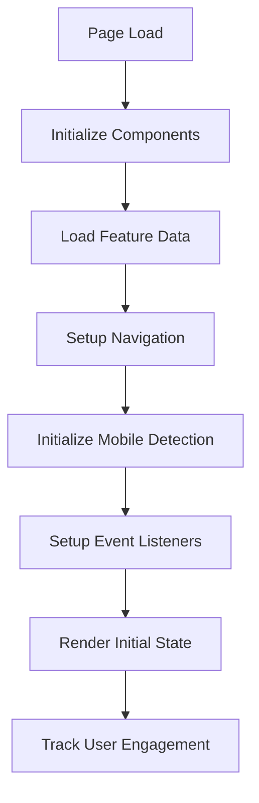
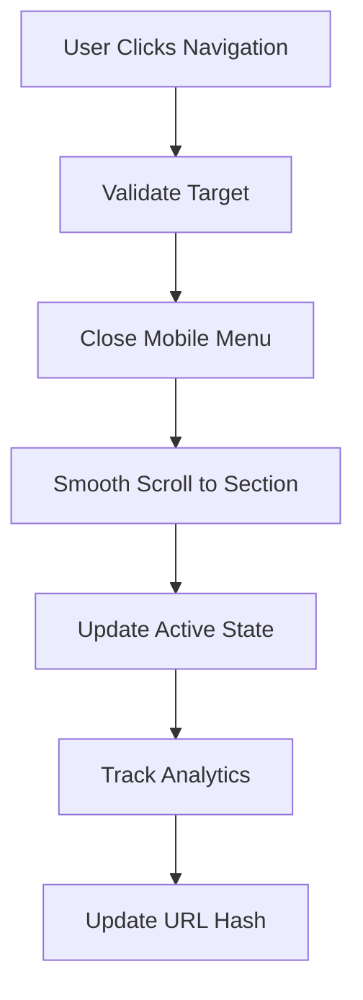
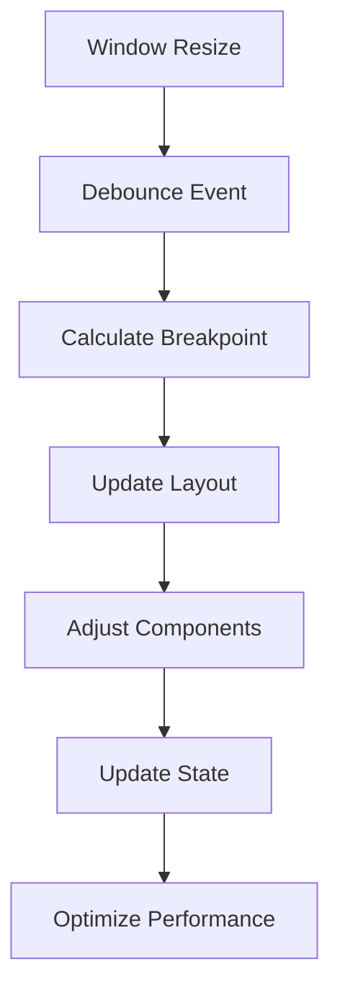

# Business Logic Documentation

This document outlines the business logic, functional requirements, and data handling patterns of the landing page application.

## Overview

The landing page is a static marketing website designed to showcase educational platform features and attract potential users. The business logic focuses on user engagement, information presentation, and responsive user experience.

## Core Business Functions

### 1. User Engagement

#### Navigation Logic
```typescript
// Navigation state management
interface NavigationState {
  activeSection: string;
  isMenuOpen: boolean;
  scrollPosition: number;
}

// Business rules:
// - Highlight current section based on scroll position
// - Toggle mobile menu on small screens
// - Smooth scroll to sections on navigation click
```

#### User Interaction Tracking
```typescript
// User behavior analytics
interface UserInteraction {
  action: 'scroll' | 'click' | 'hover';
  target: string;
  timestamp: Date;
  duration?: number;
}

// Business rules:
// - Track section engagement time
// - Monitor feature interest
// - Record navigation patterns
```

### 2. Content Presentation

#### Feature Showcase Logic
```typescript
// Feature data structure
interface Feature {
  index: string;
  title: string;
  description: string;
  icon?: string;
  priority: number;
}

// Business rules:
// - Display features in priority order
// - Highlight key features first
// - Group related features
```

#### Responsive Content Logic
```typescript
// Content adaptation based on device
interface ResponsiveContent {
  isMobile: boolean;
  layout: 'stacked' | 'grid' | 'sidebar';
  contentDensity: 'compact' | 'normal' | 'expanded';
}

// Business rules:
// - Optimize content for mobile devices
// - Use grid layout on desktop
// - Adjust content density based on screen size
```

### 3. Mobile Detection Logic

#### Breakpoint Management
```typescript
// Mobile detection hook logic
const MOBILE_BREAKPOINT = 768;

interface MobileState {
  isMobile: boolean | undefined;
  screenWidth: number;
  isTablet: boolean;
  isDesktop: boolean;
}

// Business rules:
// - Mobile: < 768px
// - Tablet: 768px - 1024px
// - Desktop: > 1024px
// - Debounce resize events for performance
```

## Data Models

### 1. Feature Data

```typescript
interface FeatureData {
  index: string;
  title: string;
  description: string;
  category: 'management' | 'tracking' | 'materials' | 'communication';
  priority: 1 | 2 | 3;
  isActive: boolean;
}

// Sample business data:
const features: FeatureData[] = [
  {
    index: "I",
    title: "Управління заняттями",
    description: "Створення, редагування та видалення занять. Гнучке налаштування розкладу та параметрів кожного заняття.",
    category: "management",
    priority: 1,
    isActive: true
  },
  {
    index: "II", 
    title: "Облік відвідуваності",
    description: "Автоматична фіксація присутності студентів на заняттях. Формування звітів та аналітики відвідуваності.",
    category: "tracking",
    priority: 2,
    isActive: true
  },
  {
    index: "III",
    title: "Навчальні матеріали",
    description: "Завантаження та розповсюдження навчальних ресурсів. Структурована бібліотека матеріалів за курсами.",
    category: "materials",
    priority: 3,
    isActive: true
  }
];
```

### 2. Navigation Data

```typescript
interface NavigationItem {
  id: string;
  label: string;
  href: string;
  isActive: boolean;
  order: number;
}

const navigationItems: NavigationItem[] = [
  {
    id: "home",
    label: "Головна",
    href: "#home",
    isActive: true,
    order: 1
  },
  {
    id: "about",
    label: "Про нас",
    href: "#about",
    isActive: false,
    order: 2
  },
  {
    id: "features",
    label: "Особливості",
    href: "#features",
    isActive: false,
    order: 3
  },
  {
    id: "contact",
    label: "Контакти",
    href: "#contact",
    isActive: false,
    order: 4
  }
];
```

### 3. User State

```typescript
interface UserState {
  currentSection: string;
  scrollDirection: 'up' | 'down' | 'none';
  lastScrollPosition: number;
  hasScrolled: boolean;
  menuOpen: boolean;
}

// Business rules for user state:
// - Track scroll direction for header visibility
// - Update current section based on viewport
// - Manage mobile menu state
// - Optimize performance with debouncing
```

## Business Rules

### 1. Content Display Rules

#### Feature Prioritization
```typescript
// Business logic for feature display
function sortFeaturesByPriority(features: FeatureData[]): FeatureData[] {
  return features.sort((a, b) => a.priority - b.priority);
}

// Rules:
// - Priority 1: Core features (lesson management)
// - Priority 2: Secondary features (attendance tracking)
// - Priority 3: Supporting features (materials)
// - Always show active features first
```

#### Responsive Content Rules
```typescript
// Content adaptation logic
function getLayoutForScreen(width: number): ResponsiveContent {
  if (width < 768) {
    return {
      isMobile: true,
      layout: 'stacked',
      contentDensity: 'compact'
    };
  } else if (width < 1024) {
    return {
      isMobile: false,
      layout: 'grid',
      contentDensity: 'normal'
    };
  } else {
    return {
      isMobile: false,
      layout: 'sidebar',
      contentDensity: 'expanded'
    };
  }
}
```

### 2. Interaction Rules

#### Navigation Rules
```typescript
// Navigation business logic
interface NavigationRules {
  // Rule: Highlight active section
  highlightActiveSection: (scrollPosition: number) => string;
  
  // Rule: Smooth scroll to section
  scrollToSection: (sectionId: string) => void;
  
  // Rule: Toggle mobile menu
  toggleMobileMenu: () => void;
  
  // Rule: Close menu on section click
  closeMenuOnNavigation: () => void;
}

// Implementation:
const navigationRules: NavigationRules = {
  highlightActiveSection: (scrollPosition) => {
    // Calculate which section is in viewport
    // Return section ID for highlighting
  },
  
  scrollToSection: (sectionId) => {
    // Smooth scroll to target section
    // Update URL hash
    // Close mobile menu
  },
  
  toggleMobileMenu: () => {
    // Toggle menu state
    // Prevent body scroll when open
    // Focus management for accessibility
  },
  
  closeMenuOnNavigation: () => {
    // Close mobile menu
    // Restore body scroll
    // Remove focus trap
  }
};
```

### 3. Performance Rules

#### Scroll Optimization
```typescript
// Performance optimization for scroll events
function createOptimizedScrollHandler(
  callback: (position: number) => void,
  delay: number = 16
) {
  let ticking = false;
  
  return (position: number) => {
    if (!ticking) {
      requestAnimationFrame(() => {
        callback(position);
        ticking = false;
      });
      ticking = true;
    }
  };
}

// Business rules:
// - Throttle scroll events to 60fps
// - Use requestAnimationFrame for smooth updates
// - Debounce resize events
// - Optimize for mobile performance
```

## Error Handling

### 1. Validation Rules

```typescript
// Input validation for business logic
interface ValidationRules {
  validateScrollPosition: (position: number) => boolean;
  validateSectionId: (id: string) => boolean;
  validateFeatureData: (feature: FeatureData) => boolean;
}

const validationRules: ValidationRules = {
  validateScrollPosition: (position) => {
    return typeof position === 'number' && 
           position >= 0 && 
           position <= document.body.scrollHeight;
  },
  
  validateSectionId: (id) => {
    return typeof id === 'string' && 
           id.length > 0 && 
           document.getElementById(id) !== null;
  },
  
  validateFeatureData: (feature) => {
    return feature.title && 
           feature.description && 
           feature.priority >= 1 && 
           feature.priority <= 3;
  }
};
```

### 2. Error Recovery

```typescript
// Error recovery strategies
interface ErrorRecovery {
  handleScrollError: (error: Error) => void;
  handleNavigationError: (error: Error) => void;
  handleRenderError: (error: Error) => void;
}

const errorRecovery: ErrorRecovery = {
  handleScrollError: (error) => {
    console.warn('Scroll error:', error);
    // Reset scroll position to top
    window.scrollTo(0, 0);
  },
  
  handleNavigationError: (error) => {
    console.warn('Navigation error:', error);
    // Fallback to default section
    window.location.hash = '#home';
  },
  
  handleRenderError: (error) => {
    console.error('Render error:', error);
    // Show error fallback UI
    // Log error for debugging
  }
};
```

## State Management

### 1. Local State Pattern

```typescript
// Component-level state management
interface ComponentState<T> {
  data: T;
  loading: boolean;
  error: Error | null;
  lastUpdated: Date;
}

// Generic state update pattern
function updateComponentState<T>(
  currentState: ComponentState<T>,
  updates: Partial<ComponentState<T>>
): ComponentState<T> {
  return {
    ...currentState,
    ...updates,
    lastUpdated: new Date()
  };
}
```

### 2. Event Handling Pattern

```typescript
// Event handling with business logic
interface EventHandler<T> {
  (event: T): void;
}

// Business event handlers
const businessEventHandlers = {
  onSectionScroll: (event: Event) => {
    const scrollPosition = window.scrollY;
    // Update active section
    // Update navigation state
    // Track user engagement
  },
  
  onNavigationClick: (event: MouseEvent) => {
    const target = event.target as HTMLElement;
    const sectionId = target.getAttribute('href');
    // Navigate to section
    // Update analytics
    // Close mobile menu
  },
  
  onResize: (event: Event) => {
    const windowWidth = window.innerWidth;
    // Update responsive layout
    // Adjust component states
    // Optimize for new screen size
  }
};
```

## Business Workflows

### 1. Page Load Workflow



### 2. Navigation Workflow



### 3. Responsive Workflow



## Analytics and Tracking

### 1. User Behavior Tracking

```typescript
// Analytics tracking logic
interface AnalyticsEvent {
  category: 'navigation' | 'engagement' | 'interaction';
  action: string;
  label: string;
  value: number;
  timestamp: Date;
}

function trackUserBehavior(event: AnalyticsEvent): void {
  // Send to analytics service
  // Track user journey
  // Measure engagement time
  // Record feature interactions
}

// Business metrics to track:
// - Section engagement time
// - Feature click rates
// - Navigation patterns
// - Mobile vs desktop usage
// - Scroll depth
```

### 2. Performance Metrics

```typescript
// Performance tracking
interface PerformanceMetrics {
  pageLoadTime: number;
  timeToInteractive: number;
  scrollPerformance: number;
  renderTime: number;
  memoryUsage: number;
}

function trackPerformance(metrics: PerformanceMetrics): void {
  // Monitor core web vitals
  // Track user experience
  // Identify performance issues
  // Optimize based on data
}
```

## Business Constraints

### 1. Technical Constraints

- **Static Content**: No server-side data fetching required
- **Client-Side Only**: All logic runs in the browser
- **Responsive Design**: Must work on all device sizes
- **Accessibility**: WCAG 2.1 AA compliance required
- **Performance**: < 3 second load time on 3G

### 2. Business Constraints

- **Language**: Ukrainian language support required
- **Content**: Educational platform focus
- **Target Audience**: Students and educators
- **Conversion Goals**: Lead generation and user sign-ups
- **Brand Guidelines**: Consistent visual identity

### 3. Compliance Requirements

- **GDPR**: User data protection
- **Privacy Policy**: Clear data usage terms
- **Cookie Policy**: Transparent tracking disclosure
- **Accessibility**: Screen reader and keyboard support
- **Performance**: Core Web Vitals compliance

## Future Business Logic

### 1. Planned Enhancements

#### Advanced User Tracking
```typescript
// Future analytics features
interface AdvancedAnalytics {
  userSessionId: string;
  journeyMapping: NavigationEvent[];
  heatMapData: ClickPosition[];
  conversionTracking: ConversionEvent[];
}
```

#### Personalization Logic
```typescript
// Content personalization
interface PersonalizationRules {
  userPreferences: UserPreferences;
  contentAdaptation: ContentVariants;
  aBTesting: ExperimentConfig;
}
```

### 2. Integration Points

#### API Integration
```typescript
// Future data fetching
interface APIIntegration {
  userAuthentication: AuthService;
  contentManagement: ContentService;
  analyticsTracking: AnalyticsService;
  leadGeneration: LeadService;
}
```

#### Third-Party Services
```typescript
// Service integrations
interface ThirdPartyServices {
  crm: CustomerRelationshipManager;
  email: EmailMarketingService;
  analytics: WebAnalyticsService;
  chat: CustomerSupportService;
}
```

## Testing Business Logic

### 1. Unit Testing Strategy

```typescript
// Business logic test cases
describe('Feature Prioritization', () => {
  test('should sort features by priority', () => {
    const features = [
      { priority: 3, title: 'Feature C' },
      { priority: 1, title: 'Feature A' },
      { priority: 2, title: 'Feature B' }
    ];
    
    const sorted = sortFeaturesByPriority(features);
    
    expect(sorted[0].title).toBe('Feature A');
    expect(sorted[1].title).toBe('Feature B');
    expect(sorted[2].title).toBe('Feature C');
  });
});
```

### 2. Integration Testing

```typescript
// End-to-end business workflows
describe('Navigation Workflow', () => {
  test('should complete navigation flow', async () => {
    // User clicks navigation item
    // Smooth scroll occurs
    // Active section updates
    // URL hash changes
    // Analytics tracked
  });
});
```

---

*This business logic document serves as a comprehensive guide for understanding the application's functional requirements, data handling patterns, and business rules.*